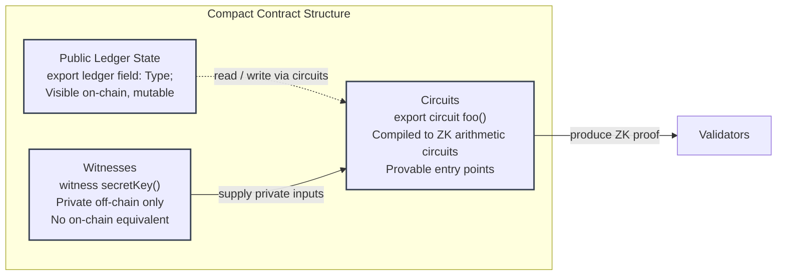
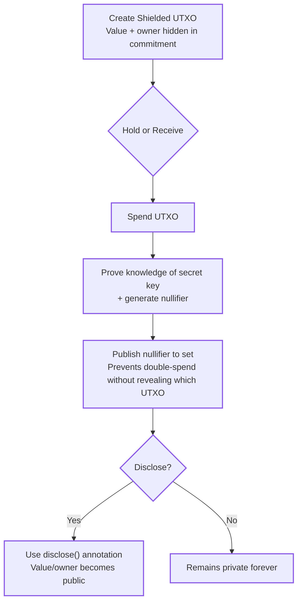
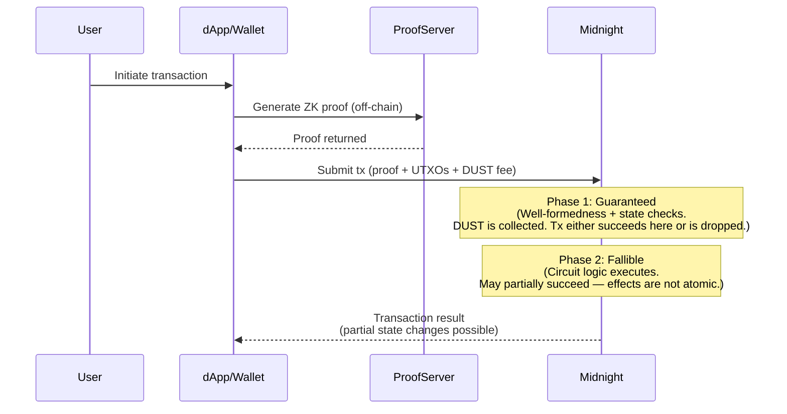
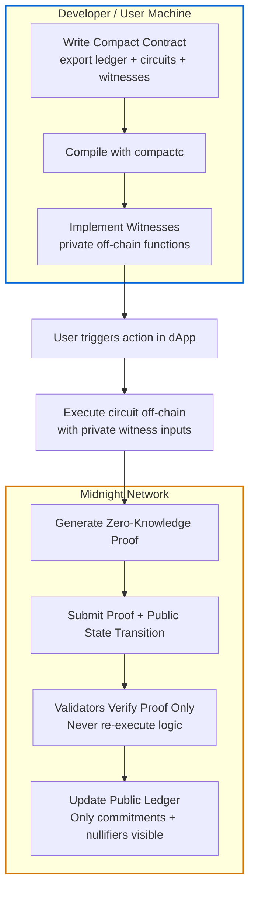

# Midnight Technical Guides

Developer migration guides for the [Midnight Network](https://midnight.network) — a privacy-first, ZK-powered L1 blockchain built as a Cardano partner chain.

These guides are written for experienced blockchain developers who are evaluating or actively building on Midnight. Each one starts from your existing mental model and maps it precisely to Midnight's architecture, language, and tooling — rather than making you start from zero.

All guides target Midnight mainnet (launched March 2026) and Compact `language_version >= 0.23`.

---

## Guides

| Guide | Audience |
|---|---|
| [From Ethereum to Midnight](./ethereum-to-midnight.md) | Solidity / EVM developers |
| [From Solana to Midnight](./solana-to-midnight.md) | Rust / Anchor / SVM developers |
| [From Polkadot to Midnight](./polkadot-to-midnight.md) | ink! / Substrate / parachain developers |
| [From Cosmos to Midnight](./cosmos-to-midnight.md) | CosmWasm / Cosmos SDK developers |
| [From Cardano to Midnight](./cardano-to-midnight.md) | Aiken / Plutus / eUTXO developers |

Each guide includes:
- What carries over from your current ecosystem (and why)
- What needs to be completely rewired
- Architecture comparison with your familiar mental model
- Language comparison with side-by-side code examples
- State model, token model, transaction model, and fee model comparisons
- Toolchain mapping (your tools → Midnight equivalents)
- Security patterns: what disappears, what still applies, what's new
- A full cheat sheet of concept-to-concept mappings
- A suggested learning path to get productive fast

---

## What These Guides Cover

### The Core Concepts (covered in every guide)

**The ZK execution model.** Midnight contracts don't run on-chain. They run on the user's machine and produce a ZK proof. The chain verifies the proof. Validators never re-execute your logic and never see private inputs.

**The three-part contract structure.** Every Compact contract has public ledger state (`export ledger` fields), circuits (the provable entry points compiled to ZK arithmetic circuits), and witnesses (private off-chain functions with no equivalent in most other ecosystems).



**Privacy by default.** Any value derived from a witness function is private. The Compact compiler statically enforces this — private-origin data cannot reach the public ledger without an explicit `disclose()` annotation. Privacy is a compile-time guarantee, not a runtime check.

**The UTXO model with shielding.** Midnight uses a UTXO model extended with ZK-based commitments that hide value and ownership. Shielding is a per-UTXO property; a single transaction can mix shielded and unshielded UTXOs.



**NIGHT and DUST.** NIGHT is the publicly transferable governance/staking token. DUST is a non-transferable resource generated passively by holding NIGHT, used to pay transaction fees. The split decouples fee costs from token price volatility and enables sponsored (gasless) transactions for end users.

**The two-phase transaction model.** Unlike the all-or-nothing revert semantics of most chains, Midnight transactions have a guaranteed phase (always succeeds or the transaction is dropped) and a fallible phase (can partially succeed). Understanding this is critical for safe contract design.



**Cross-contract calls are not yet available.** Compact 1.0 reserves the `contract` keyword for future cross-contract call support, but it is not currently implemented. Composition happens at compile time via module imports, not at runtime.



### The Critical Security Pattern

Every guide highlights the `ownPublicKey()` vulnerability, which is explicitly documented in the official Midnight security guide:

> **Never use `ownPublicKey()` for access control in Compact circuits.** It compiles to an unconstrained private input that the prover can set to any value — including the stored authority commitment — without knowing any secret key.

The correct pattern uses a custom helper circuit wrapping `persistentHash` with a domain tag and the round counter:

```compact
witness secretKey(): Bytes<32>;

circuit ownerKey(sk: Bytes<32>): Bytes<32> {
    return persistentHash<Vector<3, Bytes<32>>>(
        [pad(32, "myapp:owner:"), round as Bytes<32>, sk]
    );
}

export circuit restrictedAction(): [] {
    assert(ownerKey(secretKey()) == authority, "Not authorized");
    // ...
}
```

This pattern appears correctly in the official bulletin board tutorial and the `Writing a contract` docs. All guides in this series use it.

---

## Common Corrections Across All Guides

These docs were written and verified against primary sources (Midnight docs, MIPs, the Compact compiler reference). Several claims that appear in other Midnight community materials are corrected throughout:

| Incorrect | Correct |
|---|---|
| `ledger { field: Type; }` block syntax | `export ledger field: Type;` (flat declarations) |
| `round = round + 1` | `round.increment(1)` — `Counter` type has an increment method |
| `ownPublicKey()` for access control | Custom `persistentHash` circuit with domain separation |
| "Cross-contract calls via module imports" | Module imports work at compile time; **no runtime cross-contract calls in Compact 1.0** |
| "Check current docs" for failed tx fees | Two-phase model: guaranteed-phase DUST is forfeited on fallible-phase failure |
| "Mainnet" (unqualified) | Federated mainnet — trusted operators currently; SPO decentralization in Mōhalu phase |

---

## Status and Versioning

| Field | Value |
|---|---|
| Midnight mainnet | March 31, 2026 (federated phase) |
| Compact version | `language_version >= 0.23` |
| Last reviewed | June 2026 |
| Cross-contract calls | Not yet implemented (Compact 1.0) |
| Zswap mechanics | Stable conceptually; implementation not yet performance-optimized |

Midnight is moving fast. Compact compiler releases have been frequent. Always verify code examples against the current compiler version before shipping. The [Midnight MCP server](https://docs.midnight.network/blog/midnight-mcp-ai-assisted-development) validates Compact code against the live compiler and is recommended for any AI-assisted development.

---

## Official Resources

| Resource | URL |
|---|---|
| Docs | https://docs.midnight.network |
| Compact Language Reference | https://docs.midnight.network/compact |
| Smart Contract Security | https://docs.midnight.network/compact/smart-contract-security |
| Transaction Semantics | https://docs.midnight.network/concepts/how-midnight-works/semantics |
| Writing a Contract | https://docs.midnight.network/compact/writing |
| Bulletin Board Tutorial | https://docs.midnight.network/tutorials/bboard |
| DUST Architecture | https://docs.midnight.network/concepts/dust-architecture |
| Zswap | https://docs.midnight.network/concepts/how-midnight-works/zswap |
| OpenZeppelin for Compact | https://docs.openzeppelin.com/contracts-compact |
| Midnight MCP | https://docs.midnight.network/blog/midnight-mcp-ai-assisted-development |
| Discord | https://discord.com/invite/midnightnetwork |

---

## Contributing

Corrections and additions welcome via PR. If you find a Compact code example that fails against the current compiler, or a Midnight protocol detail that has changed since June 2026, please open an issue or submit a fix.

Before submitting, verify any Compact code examples against the current compiler version using `compactc` or the Midnight MCP toolchain.

---

*These guides are produced independently and are not official Midnight Foundation documentation. For canonical protocol specifications, consult [docs.midnight.network](https://docs.midnight.network) and the [Midnight Improvement Proposals repository](https://github.com/midnightntwrk/midnight-improvement-proposals).*

---

## License

This repository is licensed under the [MIT License](LICENSE).  
See the [LICENSE](LICENSE) file for the full text.
